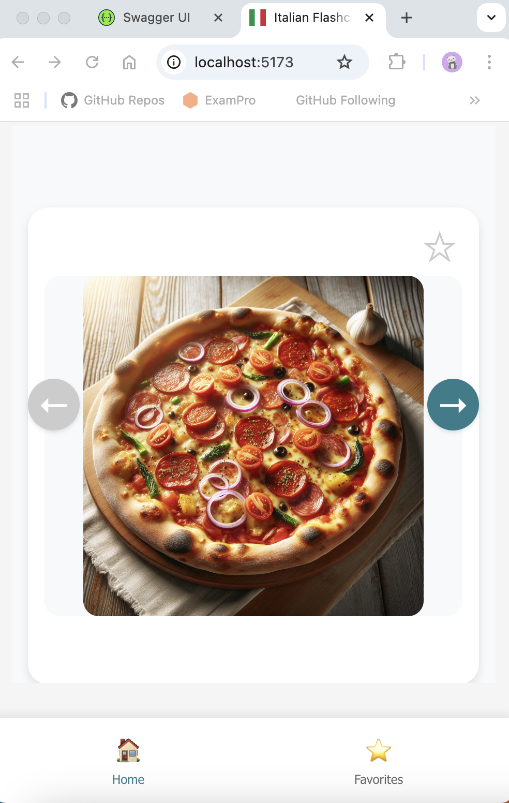
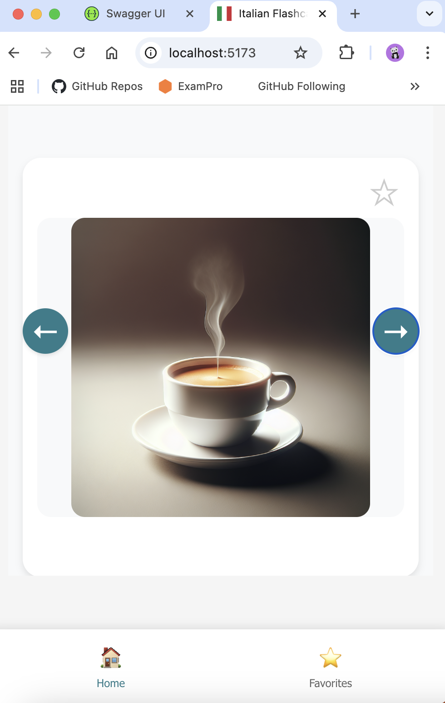
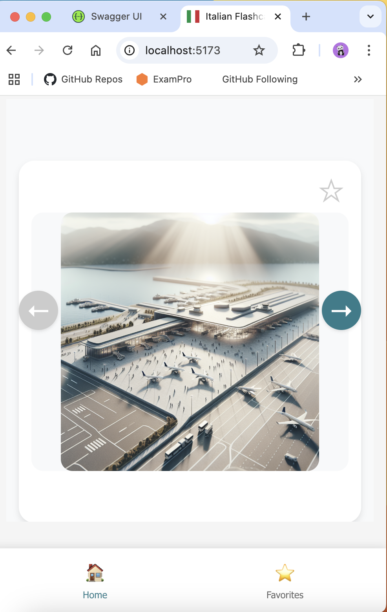
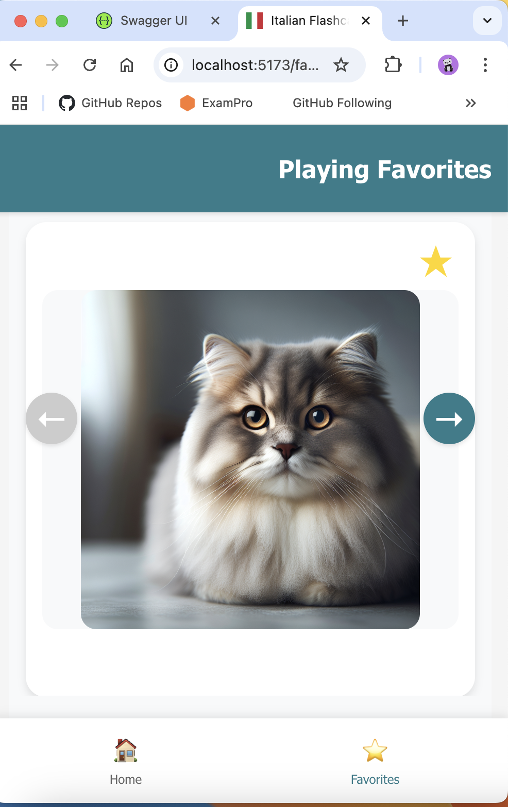

# Italian Flashcards App

A mobile-first web application for learning Italian through interactive flashcards, featuring AI-powered image generation and personalized learning experiences. Designed for seamless learning across all devices.

## Table of Contents
- [Features](#features)
- [Tech Stack](#tech-stack)
- [AI Implementation](#ai-implementation)
- [Project Structure](#project-structure)
- [Development Guide](#development-guide)
- [API Documentation](#api-documentation)
- [License](#license)

## Features

### Current Features
- **Core Learning Experience**
  - Mobile-first design
  - Interactive flashcard interface
  - Responsive design that adapts to all screen sizes
  - Basic flashcard navigation and display

- **AI-Powered Features**
  - AI-generated illustrations for each vocabulary word
  - Support for multiple AI models (AWS Bedrock and OpenAI)
  - Consistent, educational-style image generation

- **Data Management**
  - MongoDB database integration
  - Basic data storage and retrieval
  - JSON-based vocabulary data structure

### Future Features
- **User Progress System**
  - [ ] Track individual word learning progress
  - [ ] Store user completion rates
  - [ ] Generate progress reports
  - [ ] Learning streak tracking

- **Image Generation Optimization**
  - [ ] Implement image caching system for generated images
  - [ ] Cache invalidation strategy for outdated images
  - [ ] CDN integration for faster image delivery
  - [ ] Batch generation of images for new vocabulary sets

- **Learning Enhancement**
  - [ ] Favorites system for saving and organizing flashcards
  - [ ] Learning history tracking
  - [ ] Performance analytics
  - [ ] Spaced repetition system
  - [ ] Progress-based recommendations
  - [ ] User authentication system
  - [ ] Personalized learning paths

## Tech Stack

### Frontend
- React 19
- Vite
- React Router DOM
- Axios for API communication
- React Icons for UI elements

### Backend
- Node.js with Express
- AWS Bedrock for AI features
- OpenAI integration
- Rate limiting and security features

## AI Implementation

### Image Generation System
The application uses advanced AI models to generate educational illustrations for each vocabulary word. Features include:

- **Multiple Model Support**: 
  - DALL-E (OpenAI) is set as the default model for its consistent quality and reliability
  - AWS Bedrock serves as a backup option when DALL-E is unavailable or rate-limited
- **Consistent Style**: Maintains educational, minimalist illustration style
- **Quality Control**: Implements negative prompts to avoid unwanted elements
- **Error Handling**: Robust error management for API failures

### Prompting System Status

The current prompting system requires further refinement as it faces several challenges:

- **Category-Specific Optimization**: The current generic prompt template doesn't work equally well across all categories. For example:
  - Works well for: concrete objects (food, animals)
  - Needs improvement for: abstract concepts, actions, and descriptive terms
  
- **Prompt Refinement Needed**: Future updates should include:
  - Category-specific prompt templates
  - Better context handling for different word types
  - More precise style guidance for educational illustrations
  - Enhanced cultural context for Italian-specific terms

- **Planned Improvements**:
  - [ ] Develop specialized prompts for each category
  - [ ] Implement A/B testing for prompt effectiveness
  - [ ] Add prompt versioning for quality tracking
  - [ ] Create a feedback loop for prompt optimization

### Current Prompt Templates

#### DALL-E (Default Model)
```javascript
{
  // Default template for concrete objects
  template: 'A professional, high-quality photograph of {word}. The image should be crisp and clear, shot in natural lighting with a clean, uncluttered background. Focus on creating a realistic, educational representation with excellent detail and composition. No text or labels should be present.',
  // Template for abstract concepts
  abstract: 'A meaningful scene that represents the concept of {word} in Italian culture. Create a rich visual metaphor using cultural elements and symbolism. The image should be evocative and clear without using any text or labels.',
  negativePrompt: 'text, letters, alphabet, words, numbers, writing, handwriting, calligraphy, fonts, characters, symbols, subtitles, captions, labels, watermarks, signatures, cartoon, illustration, vector art, drawing'
}
```

#### Nova Canvas (AWS Bedrock)
```javascript
{
  // Default template for concrete objects
  template: 'Create a high-quality, realistic photograph representing {word}. The image should be clear, well-lit, and focused on the main subject. Use natural lighting and a clean background. The photo should be professional and educational in nature, suitable for learning purposes.',
  // Template for abstract concepts
  abstract: 'Create an evocative scene that symbolizes the concept of {word} in Italian culture. Use meaningful visual metaphors and cultural elements to convey the meaning. The image should be rich in symbolism while remaining clear and educational.',
  style: 'professional photography, high resolution, clear focus, natural lighting, realistic image, authentic Italian setting',
  negativePrompt: 'text, letters, words, numbers, writing, handwriting, symbols, watermark, signature, label, caption, subtitle, cartoon, illustration, vector art, drawing, sketch, animation'
}
```

### Model Router
The application uses a flexible model router system that allows switching between different AI models for content generation. The model router provides a unified interface for all AI operations, making it easy to:
- Switch between different models at runtime
- Add new models without changing the application logic
- Handle model-specific configurations and error cases
- Maintain consistent API responses regardless of the underlying model

### Planned Image Caching System
The application will implement a sophisticated caching system for AI-generated images to:
- Reduce API costs by preventing redundant image generation
- Improve response times for frequently accessed flashcards
- Optimize storage usage with efficient cache management
- Enable offline access to previously generated images

Key components will include:
- **Storage Layer**: File system or object storage (S3) for image files
- **Cache Index**: Database tracking of image metadata and associations
- **Cache Strategy**: LRU (Least Recently Used) eviction policy
- **Invalidation Rules**: Based on prompt changes or time thresholds

## Project Structure
```
flashcards-app/
├── frontend/           # React frontend application
│   ├── src/           # Source code
│   ├── public/        # Static assets
│   └── API.md         # API documentation
├── backend/           # Node.js backend server
│   ├── models/        # Model handlers and configurations
│   ├── data/          # Data files
│   └── server.js      # Main server file
└── docs/             # Project documentation
```

## Data Management

The application uses a hybrid data storage approach:

### Current Implementation
- JSON files for vocabulary data (`backend/data/vocabulary.json`)
- MongoDB database for dynamic data
- Structured categories and words with translations, examples, and metadata

### MongoDB Integration
The MongoDB setup is prepared for future features:
- Store user progress and statistics
- Save favorite words
- Track learning history
- Enable user-specific features

## Development Guide

### Prerequisites
- Node.js (v18 or higher)
- AWS Account (for Bedrock features)
- OpenAI API key
- Git

### Development Tools
- ESLint for code quality
- Vite for fast development and building
- Hot module replacement
- React Developer Tools (recommended)

### Installation

1. Clone the repository:
```bash
git clone <repository-url>
cd flashcards-app
```

2. Set up the backend:
```bash
cd backend
npm install
cp .env.example .env
# Edit .env with your configuration
```

3. Set up the frontend:
```bash
cd ../frontend
npm install
```

### Environment Variables
Create a `.env` file in the backend directory:
```
# AWS credentials for Bedrock
AWS_ACCESS_KEY_ID=your_aws_access_key
AWS_SECRET_ACCESS_KEY=your_aws_secret_key
AWS_REGION=your_aws_region

# OpenAI API key
OPENAI_API_KEY=your_openai_api_key
```

### Running the Application
1. Start the backend server:
```bash
cd backend
npm run dev
```

2. Start the frontend development server:
```bash
cd frontend
npm run dev
```

Access the application at `http://localhost:5173`

### Development Ports
- Frontend development server: 5173
- Backend API server: 3000

## API Documentation

The API documentation is available through Swagger UI at `http://localhost:3000/api-docs`

Features:
- Complete list of all available endpoints
- Request/response schemas
- Try-it-out functionality for testing endpoints
- Detailed parameter descriptions
- Authentication requirements

### Sample Generated Flashcard Images
Here are some examples of AI-generated images for Italian vocabulary:

| Word | Generated Image |
|------|----------------|
| Pizza |  |
| Caffè |  |
| Aeroporto |  |
| Gatto |  |

## License

This project is licensed under the ISC License - see the LICENSE file for details. 